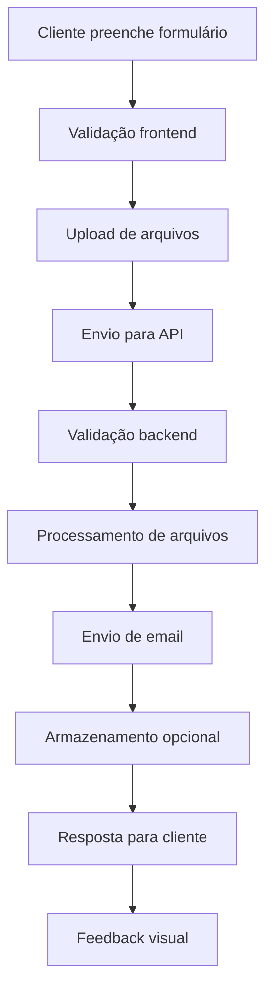

# Plano de Implementação: Sistema de Orçamentos Online

## 📋 Objetivos
1. **Formulário interativo** para coleta de dados do projeto
2. **Upload de arquivos** para referências visuais
3. **Validação robusta** dos dados
4. **Integração por email** para envio automático
5. **Feedback visual** para o usuário
6. **Armazenamento** opcional dos orçamentos

## 🏗️ Arquitetura Proposta



## 📝 Estrutura do Formulário

### Campos Principais:
1. **Dados Pessoais**
   - Nome completo
   - Email
   - Telefone/WhatsApp
   - Cidade/Estado

2. **Detalhes do Projeto**
   - Tipo de projeto (Protótipo, Decorativo, Action Figure, Peça funcional)
   - Descrição detalhada
   - Quantidade desejada
   - Material preferido (PLA, PETG, outros)
   - Dimensões aproximadas
   - Prazo desejado

3. **Arquivos de Referência**
   - Upload múltiplo de imagens
   - Arquivos 3D (.stl, .obj)
   - Documentos de especificação

4. **Orçamento**
   - Faixa de preço esperada
   - Urgência do projeto

## 🔧 Implementação Técnica

### 1. Componentes Frontend
```typescript
// QuoteForm.tsx - Formulário principal
// FileUpload.tsx - Upload de arquivos
// ProjectTypeSelector.tsx - Seleção de tipo
// MaterialSelector.tsx - Seleção de material
// QuoteProgress.tsx - Indicador de progresso
```

### 2. Backend API
```typescript
// /api/quotes - Endpoint principal
// /api/upload - Upload de arquivos
// /api/email - Serviço de email
```

### 3. Validação e Schemas
```typescript
// Zod schemas para validação
// Sanitização de dados
// Validação de arquivos
```

### 4. Integração Email
```typescript
// Nodemailer ou SendGrid
// Templates HTML responsivos
// Anexos de arquivos
```

## 📊 Fluxo de Dados

1. **Coleta**: Formulário multi-step com validação em tempo real
2. **Upload**: Drag & drop com preview e validação de tipos
3. **Processamento**: Compressão de imagens e validação de arquivos 3D
4. **Envio**: Email formatado com todos os dados e anexos
5. **Confirmação**: Feedback visual e email de confirmação

## 🎨 UX/UI Melhorada

### Características:
- **Multi-step form** com indicador de progresso
- **Drag & drop** para upload de arquivos
- **Preview** de imagens carregadas
- **Validação em tempo real** com feedback visual
- **Loading states** durante processamento
- **Success/Error states** com mensagens claras

## 🔒 Segurança

- **Rate limiting** para prevenir spam
- **Validação de tipos de arquivo**
- **Sanitização** de todos os inputs
- **Captcha** opcional para proteção adicional
- **Logs** de tentativas de envio

## 📱 Responsividade

- **Mobile-first** design
- **Touch-friendly** inputs
- **Keyboard navigation** completa
- **Accessibility** WCAG compliant

## 🚀 Fases de Implementação

### Fase 1: Estrutura Base
1. Criar componente QuoteForm
2. Implementar validação com Zod
3. Criar API endpoint básico
4. Configurar envio de email simples

### Fase 2: Upload de Arquivos
1. Implementar FileUpload component
2. Configurar multer no backend
3. Validação de tipos de arquivo
4. Preview de imagens

### Fase 3: UX Avançada
1. Multi-step form
2. Indicador de progresso
3. Loading states
4. Feedback visual

### Fase 4: Otimizações
1. Rate limiting
2. Compressão de imagens
3. Templates de email HTML
4. Logs e monitoramento

## 📋 Checklist de Implementação

- [ ] Criar schema de validação Zod
- [ ] Implementar QuoteForm component
- [ ] Configurar API endpoint /api/quotes
- [ ] Implementar upload de arquivos
- [ ] Configurar serviço de email
- [ ] Criar templates de email
- [ ] Implementar validação frontend
- [ ] Adicionar feedback visual
- [ ] Testes de integração
- [ ] Documentação da API

## 🎯 Próximos Passos

1. **Definir schema de dados** para o formulário
2. **Criar componente base** do formulário
3. **Implementar API backend** para processamento
4. **Configurar serviço de email** com templates
5. **Testes e refinamentos** da experiência do usuário